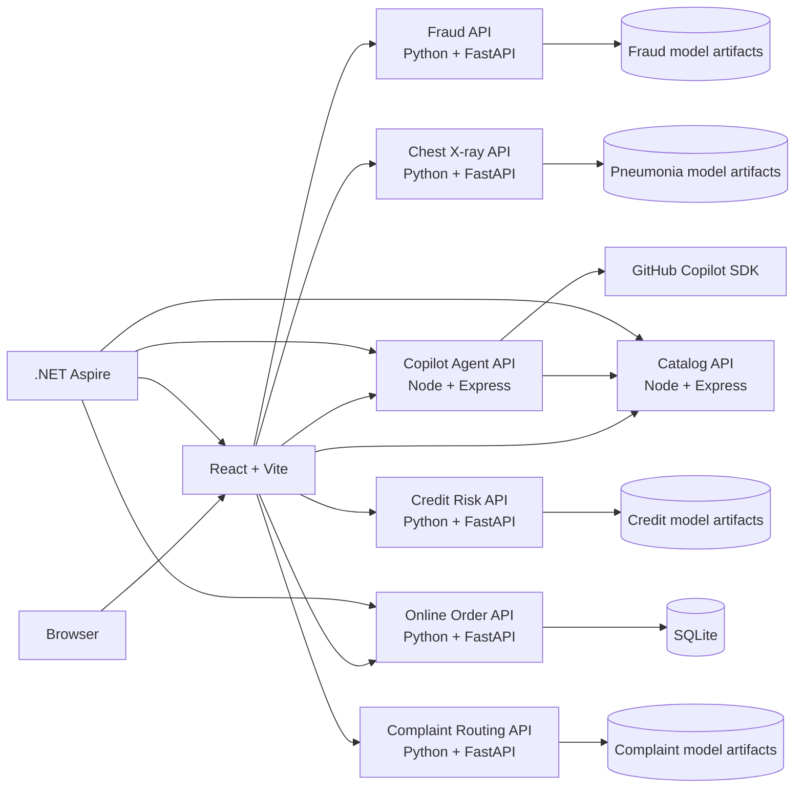

# Applied AI Studio

Applied AI Studio is a locally hosted workbench for analyzing business workflows,
judging where AI fits, and inspecting how AI outputs influence operational
decisions. It combines reusable industry workflows with an executable Online
Order application, a transaction-fraud lab, a pediatric chest X-ray
prioritization lab, and two finance labs backed by public teaching data.

> **Students — start here.** You do not need to install anything. See
> [docs/student-quickstart.md](docs/student-quickstart.md) to run this in your
> browser with GitHub Codespaces.

The repository contains no private customer data, API keys, model credentials, or
database files. GitHub Copilot features use the current user's authenticated
Copilot CLI session; authentication material remains outside the project.

## Highlights

- Ten detailed industry workflows, including Online Order, Card Transaction,
  Pediatric Chest X-ray Prioritization, Credit Risk, and Complaint Routing.
- Map → Judge AI Fit → Design What Survives analysis method.
- Deterministic AI-fit scoring with a gated solution blueprint.
- Executable Online Order storefront, customer tracking, merchant operations,
  and scenario controls.
- Five-stage fraud and chest X-ray notebooks with artifact-backed FastAPI and
  React workbenches.
- Module 4 credit-risk and complaint-routing notebooks, offline HTML, validated
  model bundles, and an optional captured LLM classification comparison.
- FastAPI, SQLAlchemy, Alembic, and SQLite order vertical.
- Persisted rule, classification, optimization, and prediction decisions.
- Explainable AI impact: signals, probabilities, thresholds, workflow branches,
  counterfactuals, and human authority.
- Double-click algorithm drill-downs covering features, training or
  configuration, test design, metrics, monitoring, and limitations.
- Sandboxed GitHub Copilot SDK gateway using only allowlisted read-only tools.
- .NET Aspire AppHost source for local composition and observability.

## Architecture



The Online Order domain is intentionally one cohesive service. Workflow steps
are explicit state transitions and decision records, not separate microservices.
See [ADR-0003](docs/adr/0003-online-order-vertical-service.md) for the trade-offs.

## Prerequisites

Required:

- [Git](https://git-scm.com/)
- [Node.js](https://nodejs.org/) 22.12 or newer
- npm 10 or newer
- Python 3.11

Optional:

- GitHub Copilot CLI access for Ask Studio and Copilot-generated workflow or
  solution drafts
- .NET 9 SDK for the Aspire launch path

The deterministic workflows, scoring, and Online Order application run without
Copilot authentication.

## Quick Start

### 1. Clone and install JavaScript dependencies

The `main` branch includes the Module 4 notebooks, demos, and workflows:

```bash
git clone --branch main https://github.com/maoyuexin/applied-ai-studio.git
cd applied-ai-studio
npm ci
```

### 2. Create the Python environment

macOS or Linux:

```bash
python3.11 -m venv .venv
npm run setup:orders
npm run setup:notebook
npm run setup:fraud
npm run prepare:fraud
npm run setup:pneumonia
npm run setup:credit
npm run setup:complaints
npm run prepare:credit
npm run prepare:complaints
npm run setup:pdm
npm run setup:procedures
npm run setup:forecast
npm run setup:recommendations
npm run prepare:pdm
npm run prepare:procedures
npm run prepare:forecast
npm run prepare:recommendations
```

Windows PowerShell:

```powershell
py -3.11 -m venv .venv
npm run setup:orders
npm run setup:notebook
npm run setup:fraud
npm run prepare:fraud
npm run setup:pneumonia
npm run setup:credit
npm run setup:complaints
npm run prepare:credit
npm run prepare:complaints
npm run setup:pdm
npm run setup:procedures
npm run setup:forecast
npm run setup:recommendations
npm run prepare:pdm
npm run prepare:procedures
npm run prepare:forecast
npm run prepare:recommendations
```

The npm scripts locate `.venv/bin/python` on macOS/Linux and
`.venv\Scripts\python.exe` on Windows.

### 3. Start all services

```bash
npm run dev
```

Open <http://127.0.0.1:5173>.

| Resource | Default address |
| --- | --- |
| React web | <http://127.0.0.1:5173> |
| Catalog API | <http://127.0.0.1:4310/health> |
| Copilot agent API | <http://127.0.0.1:4320/health> |
| Online Order API | <http://127.0.0.1:4330/health> |
| Fraud Detection API | <http://127.0.0.1:4340/health> |
| Chest X-ray Prioritization API | <http://127.0.0.1:4350/health> |
| Credit Risk API | <http://127.0.0.1:4360/health> |
| Complaint Routing API | <http://127.0.0.1:4370/health> |
| Predictive Maintenance API | <http://127.0.0.1:4380/health> |
| Procedure Assistant API | <http://127.0.0.1:4390/health> |
| Demand Forecast API | <http://127.0.0.1:4400/health> |
| Product Recommendation API | <http://127.0.0.1:4410/health> |

The Online Order demo is available directly at
<http://127.0.0.1:5173/online-order?view=customer>.
The model labs are available at <http://127.0.0.1:5173/fraud> and
<http://127.0.0.1:5173/pneumonia>.

Module 4 demos are at <http://127.0.0.1:5173/credit> and
<http://127.0.0.1:5173/complaints>. Both catalog cards also expose their complete
workflows. See [Module 4: notebooks and demos](docs/module-4.md) for the notebook
links, offline reports, and Codespaces instructions.

Modules 5 and 6 add four more labs on the same pattern. Module 5 covers predictive maintenance on real compressor telemetry (<http://127.0.0.1:5173/maintenance>) and a grounded procedure assistant that cites public safety regulation and refuses when the answer is not in its library (<http://127.0.0.1:5173/procedures>). Module 6 covers demand forecasting with prediction intervals feeding a reorder rule (<http://127.0.0.1:5173/forecast>) and product recommendations evaluated on what a shopper has never bought (<http://127.0.0.1:5173/recommendations>). Every card exposes its complete workflow alongside the demo.

The large datasets for these labs are published as GitHub Release assets rather than committed; `scripts/fetch-lab-data.mjs` downloads them once during Codespace creation, and `scripts/lab-data-manifest.json` records each file's checksum, licence and how to rebuild it from its original public source.

## GitHub Copilot Setup

Copilot is optional for deterministic functionality. To enable Ask Studio and
generated drafts:

1. Install the GitHub Copilot CLI using GitHub's official instructions.
2. Verify that `copilot --version` works.
3. Run `copilot` and complete the interactive sign-in flow if needed.
4. Start Applied AI Studio with `npm run dev`.

Do not add a Copilot token, GitHub token, or API key to this repository. The
agent uses the local CLI identity and starts lazily on the first Copilot request.

## Aspire Launch Path

After completing the Node and Python setup above and installing .NET 9:

```bash
dotnet run --project AppHost/AppHost.csproj
```

Aspire composes the web, catalog, agent, and order resources and supplies service
references to Vite. If .NET 9 is unavailable, `npm run dev` is the supported
fallback.

## Configuration

All services have safe local defaults. No credentials are required in an
environment file. [`.env.example`](.env.example) documents optional non-secret
port and model settings.

If local overrides are needed, export environment variables in the shell or use
an ignored `.env` file where supported. Never commit `.env`, `.env.local`,
database files, tokens, keys, or CLI authentication state.

Common settings:

| Variable | Default | Purpose |
| --- | --- | --- |
| `WEB_PORT` | `5173` | Vite development port |
| `CATALOG_PORT` | `4310` | Catalog API port |
| `AGENT_PORT` | `4320` | Copilot agent API port |
| `COPILOT_MODEL` | `auto` | Model selected through Copilot policy |
| `COPILOT_LOG_LEVEL` | `warning` | Copilot SDK log level |
| `CHAT_TIMEOUT_MS` | `60000` | Agent request timeout |
| `CATALOG_API_URL` | `http://127.0.0.1:4310` | Agent-to-catalog boundary |
| `DATABASE_URL` | Project-local SQLite | Online Order database URL |
| `ALLOWED_ORIGINS` | Local Vite origins | Order API CORS allowlist |

## Useful Commands

```bash
# Start all eight resources
npm run dev

# Start only the Online Order API
npm run dev:orders

# Run catalog and order tests, then build everything
npm run check

# Run only the migrated SQLite tests
npm run test:orders

# Rebuild and test the chest X-ray model service
npm run prepare:pneumonia
npm run test:pneumonia

# Audit JavaScript dependencies at high severity
npm audit --audit-level=high
```

## Local Data

The Online Order service creates and migrates its SQLite database automatically:

```text
services/order-api/data/orders.db
```

This path is ignored by Git. To reset local synthetic orders, stop the order API,
delete that file, and restart the service. Alembic recreates the schema and the
service reseeds synthetic products and inventory.

## Validation

The checked-in validation gate is:

```bash
npm audit --audit-level=high
npm run check
```

It runs:

- Catalog and deterministic scoring tests
- Migrated SQLite order-flow and algorithm-profile tests
- TypeScript builds for contracts, catalog, agent, and web
- Python bytecode compilation for the order API and migrations
- Vite production build

Live Copilot quality evaluation is intentionally separate because it requires an
authenticated Copilot account and may use metered requests.

## Security Boundary

- Public synthetic data and public educational benchmark data only
- No API keys or model credentials in browser or source files
- Copilot sessions use `mode: "empty"`
- Shell, filesystem, browser, generic network, memory, and write permissions are
  rejected
- Copilot can access catalog facts only through allowlisted custom tools
- SQLite and local session data are ignored
- Moving from loopback to a shared network requires a new authentication and
  authorization design

See [SECURITY.md](SECURITY.md) and
[ADR-0002](docs/adr/0002-copilot-identity-and-tools.md).

## Project Layout

```text
AppHost/                 .NET Aspire resource graph
apps/web/                React workflow and operations workbench
services/catalog-api/    Catalog, assessments, deterministic fit scoring
services/agent-api/      Sandboxed GitHub Copilot SDK gateway
services/order-api/      FastAPI, SQLAlchemy, Alembic, SQLite order vertical
services/fraud-api/      Artifact-backed transaction scoring and review queue
services/pneumonia-api/  Artifact-backed image scoring and review prioritization
notebooks/               Executed five-stage teaching notebooks and offline HTML
packages/contracts/      Shared Zod schemas and TypeScript contracts
data/seed/               Public teaching scenarios
docs/                    Architecture, ADRs, examples, and delivery plan
scripts/                 Cross-platform local tooling
```

## Current Scope

Online Order currently implements the deterministic happy path with synthetic
rule, classification, optimization, and prediction decisions. Exception
scenarios such as manual fraud review, oversold inventory, carrier delay, and
human remedy authorization are planned next. Algorithm training plans and metric
targets shown in that workflow are proposed designs, not claims of production
model performance. The fraud and pneumonia labs are educational, artifact-backed
demonstrations using public teaching data; neither is a production decision system.
