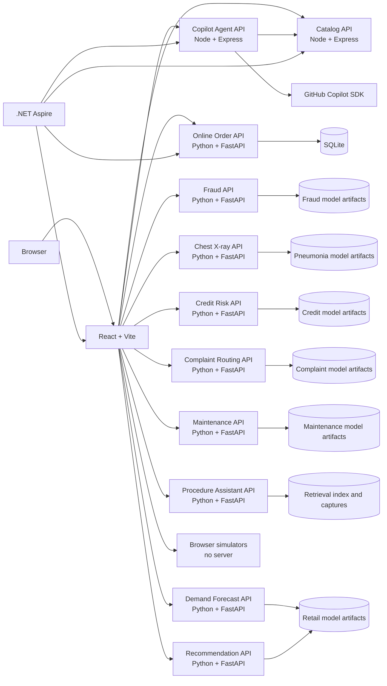

# Applied AI Studio

**An open teaching lab for applied AI in real business workflows.** Each lesson pairs slides
with an executed notebook, a browser demo, and a runnable workbench that shows exactly where a
model's output changes a business decision, and where a person keeps authority.

[](https://codespaces.new/maoyuexin/applied-ai-studio?quickstart=1)

**Lesson site (slides, notebook reports and demos, no installation):**
<https://maoyuexin.github.io/applied-ai-studio/>

## Start here

| I want to | Go to |
|---|---|
| Read slides and open notebook reports or demos in my browser | [Lesson site](https://maoyuexin.github.io/applied-ai-studio/) or [`lessons/`](lessons/README.md) |
| Run the Studio app without installing anything | [Student quickstart (Codespaces)](docs/student-quickstart.md) |
| Rerun a notebook | Open the repository in Codespaces, then the notebook linked from its lesson |
| Teach with these materials or add a lesson | [Lesson library guide](lessons/README.md#teach-with-it) and [`courses/`](courses/README.md) |
| Run or develop the Studio locally | [Run the Studio locally](#run-the-studio-locally) |

## Lessons

| # | Lesson | Worked cases | Slides | In the Studio |
|---|---|---|---|---|
| 01 | [How Work Happens, and Where AI Fits](lessons/01-work-processes/README.md) | One online order | [PDF](lessons/01-work-processes/M1_Deck_How_Work_Happens.pdf) | `/workflow`, `/online-order`, `/fit` |
| 02 | [From Data to Decision](lessons/02-data-to-decision/README.md) | Card transaction fraud | [PDF](lessons/02-data-to-decision/S2_Deck_AI_Across_Industries.pdf) | `/fraud` |
| 03 | [AI in Healthcare](lessons/03-healthcare/README.md) | Pediatric chest X-ray prioritization | [PDF](lessons/03-healthcare/M3_Deck_AI_in_Healthcare.pdf) | `/pneumonia` |
| 04 | [AI in Finance and Risk](lessons/04-finance-risk/README.md) | Credit risk review; complaint routing | [PDF](lessons/04-finance-risk/M4_Deck_AI_in_Finance.pdf) | `/credit`, `/complaints` |
| 05 | [AI in Manufacturing](lessons/05-manufacturing/README.md) | Compressor predictive maintenance; procedure assistant | [PDF](lessons/05-manufacturing/M5_Deck_AI_in_Manufacturing.pdf) | `/maintenance`, `/procedures` |
| 06 | [AI in Retail and Supply Chain](lessons/06-retail-supply-chain/README.md) | Demand forecasting; next best product; catalog onboarding | [PDF](lessons/06-retail-supply-chain/M6_Deck_AI_in_Retail.pdf) | `/forecast`, `/recommendations` |

Each lesson folder lists its readings, notebook reports, interactive demos and Studio routes.
Courses map their own modules to these lessons; see [`courses/`](courses/README.md).

## How every lesson is built

1. **Map the work.** Inputs → Process → Decision → Action → Outcome, with the decisions marked.
2. **Judge AI fit.** Ask of each decision: would it behave differently with another year of data?
3. **Design what survives.** Data → Model → Metric → Human, with the human boundary explicit.
4. **Show the evidence.** A notebook in five stages: data ingestion, preparation or feature
   engineering, training, validation, and prediction with a handoff to the app.
5. **Put it back in the workflow.** The Studio demo loads the notebook's exact artifacts and shows
   the score, the cutoff, the action it triggers, and who decides.

The repository contains no private customer data, API keys, model credentials, or
database files. GitHub Copilot features use the current user's authenticated
Copilot CLI session; authentication material remains outside the project.

## What is inside

- Fourteen industry workflows, including Online Order, Card Transaction, Pediatric Chest X-ray
  Prioritization, Credit Risk, Complaint Routing, Predictive Maintenance and retail planning.
- Map → Judge AI Fit → Design What Survives analysis method, with deterministic AI-fit scoring
  and a gated solution blueprint.
- Executable Online Order storefront, customer tracking, merchant operations, and scenario controls.
- Eight executed teaching notebooks with offline HTML reports: fraud, chest X-ray, credit risk,
  complaint routing, predictive maintenance, procedure assistant (RAG), demand forecasting and
  product recommendations, plus reference versions for deeper study.
- Artifact-backed FastAPI and React workbenches, and single-file browser simulators that need no
  server.
- Captured, replayable LLM runs (complaint classification, multimodal X-ray reading, grounded
  procedure answers, catalog extraction), so classes run offline; live reruns are optional.
- Explainable AI impact: signals, probabilities, thresholds, workflow branches,
  counterfactuals, and human authority.
- Sandboxed GitHub Copilot SDK gateway using only allowlisted read-only tools.
- .NET Aspire AppHost source for local composition and observability.

## Architecture


```mermaid
flowchart LR
    Browser[Browser] --> Web[React + Vite]
    Web --> Catalog[Catalog API<br/>Node + Express]
    Web --> Agent[Copilot Agent API<br/>Node + Express]
    Web --> Orders[Online Order API<br/>Python + FastAPI]
    Web --> Fraud[Fraud API<br/>Python + FastAPI]
    Web --> Pneumonia[Chest X-ray API<br/>Python + FastAPI]
    Web --> Credit[Credit Risk API<br/>Python + FastAPI]
    Web --> Complaints[Complaint Routing API<br/>Python + FastAPI]
    Web --> Maintenance[Maintenance API<br/>Python + FastAPI]
    Web --> Procedures[Procedure Assistant API<br/>Python + FastAPI]
    Web --> Forecast[Demand Forecast API<br/>Python + FastAPI]
    Web --> Recommend[Recommendation API<br/>Python + FastAPI]
    Web --> Simulators[Browser simulators<br/>no server]
    Agent --> Copilot[GitHub Copilot SDK]
    Agent --> Catalog
    Orders --> SQLite[(SQLite)]
    Fraud --> FraudArtifacts[(Fraud model artifacts)]
    Pneumonia --> ImageArtifacts[(Pneumonia model artifacts)]
    Credit --> CreditArtifacts[(Credit model artifacts)]
    Complaints --> ComplaintArtifacts[(Complaint model artifacts)]
    Maintenance --> PdmArtifacts[(Maintenance model artifacts)]
    Procedures --> RagArtifacts[(Retrieval index and captures)]
    Forecast --> RetailArtifacts[(Retail model artifacts)]
    Recommend --> RetailArtifacts
    Aspire[.NET Aspire] --> Web
    Aspire --> Catalog
    Aspire --> Agent
    Aspire --> Orders
```

The Online Order domain is intentionally one cohesive service. Workflow steps
are explicit state transitions and decision records, not separate microservices.
See [ADR-0003](docs/adr/0003-online-order-vertical-service.md) for the trade-offs.

## Run the Studio locally

In Codespaces everything below happens automatically; see the
[student quickstart](docs/student-quickstart.md).

### Prerequisites

Required:

- [Git](https://git-scm.com/)
- [Node.js](https://nodejs.org/) 22.12 or newer
- npm 10 or newer
- Python 3.11

Optional:

- GitHub Copilot CLI access for Ask Studio and Copilot-generated workflow or
  solution drafts
- .NET 9 SDK for the Aspire launch path

The deterministic workflows, scoring, and Online Order application run without
Copilot authentication.

### Quick Start

#### 1. Clone and install JavaScript dependencies

```bash
git clone https://github.com/maoyuexin/applied-ai-studio.git
cd applied-ai-studio
npm ci
```

#### 2. Create the Python environment

macOS or Linux:

```bash
python3.11 -m venv .venv
npm run setup:orders
npm run setup:notebook
npm run setup:fraud
npm run prepare:fraud
npm run setup:pneumonia
npm run setup:credit
npm run setup:complaints
npm run prepare:credit
npm run prepare:complaints
npm run setup:pdm
npm run setup:procedures
npm run setup:forecast
npm run setup:recommendations
npm run prepare:pdm
npm run prepare:procedures
npm run prepare:forecast
npm run prepare:recommendations
```

Windows PowerShell:

```powershell
py -3.11 -m venv .venv
npm run setup:orders
npm run setup:notebook
npm run setup:fraud
npm run prepare:fraud
npm run setup:pneumonia
npm run setup:credit
npm run setup:complaints
npm run prepare:credit
npm run prepare:complaints
npm run setup:pdm
npm run setup:procedures
npm run setup:forecast
npm run setup:recommendations
npm run prepare:pdm
npm run prepare:procedures
npm run prepare:forecast
npm run prepare:recommendations
```

The npm scripts locate `.venv/bin/python` on macOS/Linux and
`.venv\Scripts\python.exe` on Windows.

#### 3. Start all services

```bash
npm run dev
```

Open <http://127.0.0.1:5173>.

Run `npm run dev` from the repository root for the full application. Starting
only the web workspace does not start its APIs: Industry Workflows requires
the catalog API on port 4310, and the maintenance simulator requires port 4380.
A missing API can appear as a proxy error even when the web page itself loads.

| Resource | Default address |
| --- | --- |
| React web | <http://127.0.0.1:5173> |
| Catalog API | <http://127.0.0.1:4310/health> |
| Copilot agent API | <http://127.0.0.1:4320/health> |
| Online Order API | <http://127.0.0.1:4330/health> |
| Fraud Detection API | <http://127.0.0.1:4340/health> |
| Chest X-ray Prioritization API | <http://127.0.0.1:4350/health> |
| Credit Risk API | <http://127.0.0.1:4360/health> |
| Complaint Routing API | <http://127.0.0.1:4370/health> |
| Predictive Maintenance API | <http://127.0.0.1:4380/health> |
| Procedure Assistant API | <http://127.0.0.1:4390/health> |
| Demand Forecast API | <http://127.0.0.1:4400/health> |
| Product Recommendation API | <http://127.0.0.1:4410/health> |

### Lab routes

| Route | Lab | Lesson |
|---|---|---|
| `/showcase` | Industry workflows catalog; cards open a **Workflow** and, where available, a **Demo** | all |
| `/online-order?view=customer` | Online Order storefront, tracking and merchant operations | [01](lessons/01-work-processes/README.md) |
| `/fit` | AI Fit Analyzer | [01](lessons/01-work-processes/README.md) |
| `/fraud` | Card transaction fraud detection | [02](lessons/02-data-to-decision/README.md) |
| `/pneumonia` | Pediatric chest X-ray prioritization | [03](lessons/03-healthcare/README.md) |
| `/credit`, `/complaints` | Credit risk review; complaint routing ([guide](docs/module-4.md)) | [04](lessons/04-finance-risk/README.md) |
| `/maintenance`, `/maintenance-simulator` | Compressor health monitoring and telemetry simulator | [05](lessons/05-manufacturing/README.md) |
| `/procedures` | Grounded procedure assistant that cites public safety regulation and refuses when unsupported | [05](lessons/05-manufacturing/README.md) |
| `/forecast`, `/recommendations` | Demand forecasting; next best product | [06](lessons/06-retail-supply-chain/README.md) |
| `/workflow?courseCase=<id>` | The full business workflow behind a case | all |
| `/ask` | Ask Studio (needs GitHub Copilot) | all |

The maintenance simulator feeds six actual feature values in sequence at a selectable interval,
then updates the authoritative score, cutoff decision, alert signal, report label, KPIs and score
history.

The retail demos embed the same tested single-file HTML simulators that the lesson site publishes.
Vite packages photo-free public exports as local assets in production; they run model inference in
the browser without the forecast or recommendation APIs. Forecasting uses the pooled
absolute-error regressor, historical 26-week replay, MA8 comparison, feature what-ifs and grouped
attribution. Recommendations use the full catalog, fixed top-15 links, real-customer histories,
purchase simulation, exclusions and contribution explanations. Neither simulator retrains or writes
business records. Workflow maps retain the surrounding planner/merchandiser process and explicitly
separate unimplemented operational integrations from the classroom demonstration.

The older `/forecast-simulator` and `/recommendations-simulator` URLs remain available for existing
bookmarks. The earlier moving-average/interval planner is preserved at `/forecast-reference`; the
broader recommendation comparison app is at `/recommendations-reference`. Those reference pages
still require their original APIs. They are not silently relabeled as the current classroom models.

The simulator exports must exist before the web build. To regenerate them, use
`notebooks/retail-simulators/build_simulators.py` with the existing notebook environment. Editing
the source templates alone does not update the embedded exports. Product photographs retain
their separate merchant rights and are omitted from this public release, including generated HTML.
Local teaching copies may retain photos; the public versions use product names and neutral
missing-photo labels. No Git LFS installation or image download is needed in Codespaces.

Test the Studio handoff against a running server:

```sh
STUDIO_URL=http://127.0.0.1:5173 \
PLAYWRIGHT_MODULE=/absolute/path/to/playwright/index.mjs \
  node scripts/test-retail-showcase.mjs
```

Set `RETAIL_VERIFY_BUILD=1` when running against a Vite production preview to additionally compare
the served HTML assets byte-for-byte with their tested source exports. The browser test covers
both cards, workflow lenses and diagram navigation, embedded inference, purchase/undo, the absence
of duplicate Simulator actions, mobile layouts and deep-link reloads without legacy API calls.

The large datasets for these labs are published as GitHub Release assets rather than committed; `scripts/fetch-lab-data.mjs` downloads them once during Codespace creation, and `scripts/lab-data-manifest.json` records each file's checksum, licence and how to rebuild it from its original public source.

## GitHub Copilot Setup

Copilot is optional for deterministic functionality. To enable Ask Studio and
generated drafts:

1. Install the GitHub Copilot CLI using GitHub's official instructions.
2. Verify that `copilot --version` works.
3. Run `copilot` and complete the interactive sign-in flow if needed.
4. Start Applied AI Studio with `npm run dev`.

Do not add a Copilot token, GitHub token, or API key to this repository. The
agent uses the local CLI identity and starts lazily on the first Copilot request.

## Aspire Launch Path

After completing the Node and Python setup above and installing .NET 9:

```bash
dotnet run --project AppHost/AppHost.csproj
```

Aspire composes the web, catalog, agent, and order resources and supplies service
references to Vite. If .NET 9 is unavailable, `npm run dev` is the supported
fallback.

## Configuration

All services have safe local defaults. No credentials are required in an
environment file. [`.env.example`](.env.example) documents optional non-secret
port and model settings.

If local overrides are needed, export environment variables in the shell or use
an ignored `.env` file where supported. Never commit `.env`, `.env.local`,
database files, tokens, keys, or CLI authentication state.

Common settings:

| Variable | Default | Purpose |
| --- | --- | --- |
| `WEB_PORT` | `5173` | Vite development port |
| `CATALOG_PORT` | `4310` | Catalog API port |
| `AGENT_PORT` | `4320` | Copilot agent API port |
| `COPILOT_MODEL` | `auto` | Model selected through Copilot policy |
| `COPILOT_LOG_LEVEL` | `warning` | Copilot SDK log level |
| `CHAT_TIMEOUT_MS` | `60000` | Agent request timeout |
| `CATALOG_API_URL` | `http://127.0.0.1:4310` | Agent-to-catalog boundary |
| `DATABASE_URL` | Project-local SQLite | Online Order database URL |
| `ALLOWED_ORIGINS` | Local Vite origins | Order API CORS allowlist |

## Useful Commands

```bash
# Start the web app and all APIs
npm run dev

# Start only the Online Order API
npm run dev:orders

# Run all tests, then build everything
npm run check

# Run only the migrated SQLite tests
npm run test:orders

# Rebuild and test the chest X-ray model service
npm run prepare:pneumonia
npm run test:pneumonia

# Check the lesson catalog and build the lesson site into _site/
npm run test:lessons
npm run build:site

# Audit JavaScript dependencies at high severity
npm audit --audit-level=high
```

## Local Data

The Online Order service creates and migrates its SQLite database automatically:

```text
services/order-api/data/orders.db
```

This path is ignored by Git. To reset local synthetic orders, stop the order API,
delete that file, and restart the service. Alembic recreates the schema and the
service reseeds synthetic products and inventory.

## Validation

The checked-in validation gate is:

```bash
npm audit --audit-level=high
npm run check
```

It runs:

- Lesson catalog checks: every listed file exists, slide links resolve, the site builds
- Catalog and deterministic scoring tests
- Migrated SQLite order-flow and algorithm-profile tests
- Service tests for each model lab, plus notebook tests where a lab has them
- TypeScript builds for contracts, catalog, agent, and web
- Python bytecode compilation for the services and notebook packages
- Vite production build

Live Copilot quality evaluation is intentionally separate because it requires an
authenticated Copilot account and may use metered requests.

## Security Boundary

- Public synthetic data and public educational benchmark data only
- No API keys or model credentials in browser or source files
- Copilot sessions use `mode: "empty"`
- Shell, filesystem, browser, generic network, memory, and write permissions are
  rejected
- Copilot can access catalog facts only through allowlisted custom tools
- SQLite and local session data are ignored
- Moving from loopback to a shared network requires a new authentication and
  authorization design

See [SECURITY.md](SECURITY.md) and
[ADR-0002](docs/adr/0002-copilot-identity-and-tools.md).

## Project Layout

```text
lessons/                 Lesson library: slides, readings, lesson guides, lessons.json
courses/                 Course maps from modules to lessons
notebooks/               Executed five-stage teaching notebooks, offline HTML and simulators
AppHost/                 .NET Aspire resource graph
apps/web/                React workflow and operations workbench
services/catalog-api/    Catalog, assessments, deterministic fit scoring
services/agent-api/      Sandboxed GitHub Copilot SDK gateway
services/order-api/      FastAPI, SQLAlchemy, Alembic, SQLite order vertical
services/*-api/          Artifact-backed model services, one per lab
packages/contracts/      Shared Zod schemas and TypeScript contracts
data/seed/               Public teaching scenarios and workflows
docs/                    Quickstart, architecture, ADRs and lab guides
scripts/                 Cross-platform tooling, including the lesson-site builder
.github/workflows/       Lesson-site publication to GitHub Pages
```

## Courses using this library

| Course | Map |
|---|---|
| ITAI 2372 · Artificial Intelligence Applications (Houston Community College) | [courses/itai-2372](courses/itai-2372/README.md) |

To teach from the library, map your own modules to lessons under `courses/`. To contribute a
lesson, follow [Add or update a lesson](lessons/README.md#add-or-update-a-lesson).

## Current Scope

Online Order currently implements the deterministic happy path with synthetic
rule, classification, optimization, and prediction decisions. Exception
scenarios such as manual fraud review, oversold inventory, carrier delay, and
human remedy authorization are planned next. Algorithm training plans and metric
targets shown in that workflow are proposed designs, not claims of production
model performance. Every model lab is an educational, artifact-backed demonstration
using public teaching data; none is a production decision system.
