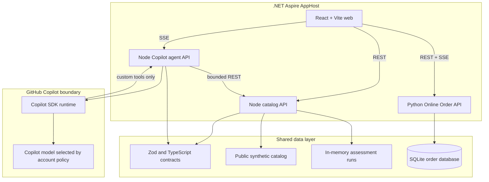
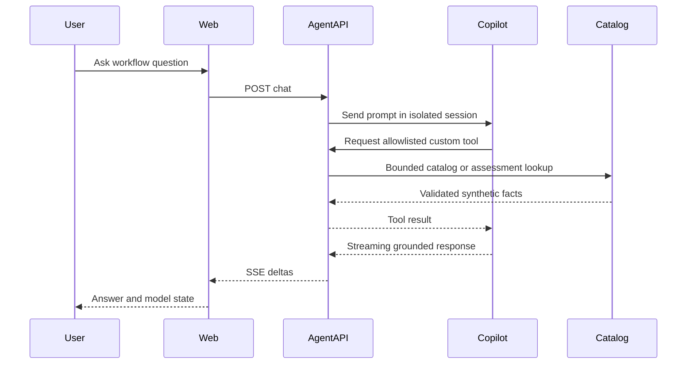

# Applied AI Studio Architecture

**Status:** Proposed MVP architecture with an executable Node scaffold

**Date:** 2026-08-05
**Primary host:** Local operator's Mac
**Reference implementation:** `OGE_Frontier/oge-demo`

## 1. Product boundary

Applied AI Studio is a bounded workflow-design environment, not a general-purpose
agent host. It applies a three-step method across industry scenarios:

1. Map the business workflow and find its decision points.
2. Judge whether each decision needs a rule, automation, optimization, AI, or a human.
3. For the AI-relevant work, specify Data, Method, Metric, and Human.

Industry cases provide reusable analysis patterns. The detailed retail workflow
follows one order from Buy Now to the doorstep with six decisions and a synthetic
operating baseline.

The first workflow release retains six comprehensive scenarios: Online
Order, Maintenance Triage, KYC Review, Resident Service Intake, Fleet Routing,
and Referral-to-Appointment Coordination. Each uses the same detailed lesson
surface and must meet the structural and design rubric in
[workflow-scenario-curation.md](workflow-scenario-curation.md).

The MVP is locally hosted and uses the local operator's GitHub Copilot account.
It is intended for local interaction on the same machine. It is not a multi-user
SaaS service and must not expose that Copilot entitlement on an unauthenticated
network.

## 2. Component model

### Web application

- Presents Industry Workflows, AI Fit Analyzer, and Ask Studio as primary navigation.
- Keeps Industry Workflows as a card-only catalog; detailed content lives on each card or its Workflow page.
- Opens Workflow and Demo pages from individual use-case cards rather than global navigation.
- Renders every retained workflow as an interactive React SVG with documented and exception paths.
- Reuses the Map, Judge AI Fit, and Design What Survives analysis method across all retained cases.
- Introduces each workflow with plain-language business context, process boundaries, and participants before presenting the diagram.
- Does not contain provider credentials or call GitHub directly.
- Renders workflow graphs from validated nodes and edges with Mermaid.
- Streams agent response text over server-sent events.

### Catalog API

- Owns the use-case catalog and deterministic fit algorithm.
- Owns the six detailed workflow scenarios, their decision designs, and the larger deferred seed catalog.
- Validates all inputs and outputs with shared Zod contracts.
- Stores assessment runs in process memory for the MVP.
- Is the only component allowed to read `data/seed`.

### Online Order API

- Owns executable order, customer, product, inventory, decision, and event state.
- Uses FastAPI with SQLAlchemy and Alembic.
- Owns one SQLite database for the local MVP; no other service opens that file.
- Advances an explicit happy-path state machine one transaction at a time.
- Publishes persisted workflow events through SSE to synchronize role views.
- Keeps AI outputs as bounded decision records rather than workflow control.
- Records model/version, input signals, output probability, policy bands,
  selected branch, process effect, business effect, counterfactual, and human
  authority for each AI decision.
- Stores algorithm-development profiles separately from runtime impact so the UI
    can explain proposed features, training and test design, metrics, monitoring,
    and limitations without claiming that synthetic demo models were trained.

### Agent API

- Owns one lazy `CopilotClient` and isolated browser conversation sessions.
- Uses the signed-in local operator identity; no token is sent to the browser.
- Starts in `mode: "empty"` with no built-in tools.
- Registers only bounded catalog, workflow-scenario, comparison, and assessment tools.
- Creates one-shot empty-mode sessions that submit schema-validated five-stage workflow drafts.
- Creates a separate one-shot solution-design session only when deterministic scoring reaches 75.
- Preserves the selected AI method and deterministic solution pattern rather than letting the model change the gate decision.
- Rejects every other permission and disables memory and session-store features.

### Aspire AppHost

- Starts and observes the web, catalog, and agent resources.
- Starts and observes the Online Order Python resource and its health surface.
- Injects the catalog endpoint into the agent.
- Injects service references into Vite for local proxy routing.
- Does not make the services microservices for organizational purposes; they
  remain one local application with explicit security boundaries.

## 3. Shared data layer

The MVP deliberately does not add PostgreSQL, Cosmos DB, or a vector database.
The data set is small, curated, versioned, and read-heavy.

| Data | Owner | MVP storage | Future trigger |
|---|---|---|---|
| Industry use cases | Catalog API | Validated JSON seed | Add authoring and approval workflow |
| Detailed workflow scenarios and introductions | Catalog API | Validated JSON seed | Add governed authoring workflow |
| Fit assessments | Catalog API | In-memory map | Persist learner history or support multiple hosts |
| Workflow drafts | Agent API | Returned to browser; not persisted | Persist only after adding learner identity and review state |
| Chat sessions | Agent API | In-memory SDK sessions | Add authenticated multi-user use |
| Schemas | Contracts package | TypeScript and Zod | Version when external modules integrate |
| Online orders and workflow events | Online Order API | SQLite via SQLAlchemy/Alembic | Move to PostgreSQL for concurrent cloud instances |

If persistence becomes necessary, add SQLite first for a single local operator.
Move to PostgreSQL only when concurrent users, durable workspaces, or remote
deployment create a real operational need.

## 4. AI fit analysis

The fit score is deterministic. Six user-scored dimensions total 100 points:

| Dimension | Weight |
|---|---:|
| Business value | 20 |
| Data readiness | 20 |
| Process repeatability | 15 |
| Integration readiness | 15 |
| Human oversight | 15 |
| Error tolerance | 15 |

The workload type selects one of six architecture patterns. Code creates the
workflow nodes and edges. A score below 75 returns readiness gaps only. At 75 or
above, Copilot receives the stored assessment and selected decision and submits a
validated solution blueprint containing Data, Method, technical and business
metrics, Human, components, risks, a PoC plan, and a second AI workflow. Copilot
does not calculate or change the score and does not generate executable Mermaid syntax.

## 5. Agent request flow

## 6. Adding industry demonstrations

There are two extension levels:

1. **Showcase-only module:** Add a validated catalog record and synthetic
   workflow. No new backend is required.
2. **Executable vertical module:** Add a dedicated backend resource only when
   the demonstration has real domain logic, such as document extraction or an
   image pipeline. Register it in Aspire and expose narrow tools through the
   agent API instead of letting Copilot call the service directly.

This keeps the first product release small while allowing later demonstrations
to resemble OGE's independently observable backends.

## 7. Security and governance

- Bind all MVP services to loopback.
- Use public synthetic seed data only.
- Keep Copilot credentials in the local CLI/keychain boundary.
- Never expose a generic URL fetch, shell, file read, file write, or browser tool.
- Require a new architecture review before adding write tools.
- Do not log prompts or responses by default.
- Export telemetry only with `captureContent: false`.
- Treat moving from single-operator local hosting to network or cloud deployment
  as a new identity and authorization design, not a configuration toggle.

## 8. Failure behavior

| Failure | User-visible behavior | Preserved capability |
|---|---|---|
| Copilot signed out or unavailable | Ask Studio reports connection failure | Industry Workflows and AI Fit Analyzer remain functional |
| Catalog API unavailable | Catalog and tools fail closed | Static shell remains visible |
| Invalid assessment input | API returns field validation error | Existing assessment remains unchanged |
| Model requests unauthorized tool | Permission rejected | Session can continue with catalog tools |
| Stream interrupted | User can retry or clear | No write or partial publication occurs |

## 9. Deployment evolution

The MVP uses Aspire for local orchestration and `npm run dev` as a verified
fallback. A later remote deployment must introduce application authentication,
per-user or organization-attributed Copilot identity, request budgets, TLS, and
network controls. It must not proxy many users through the local operator's
personal account.